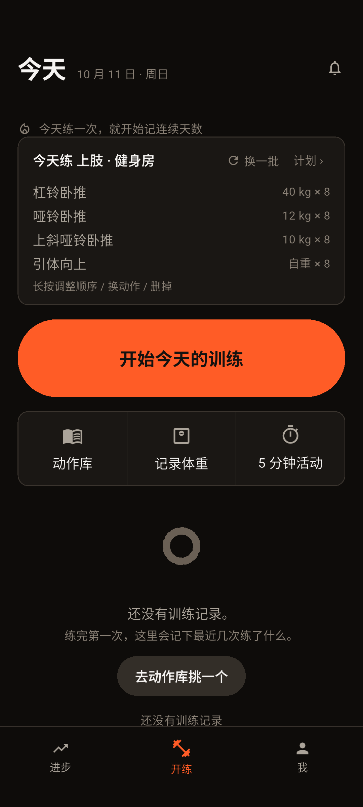
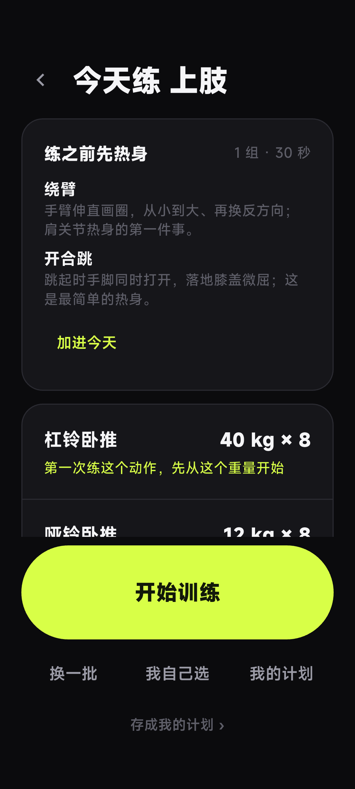
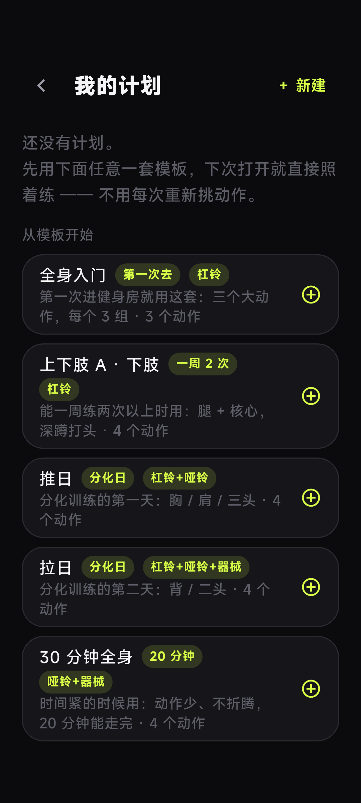
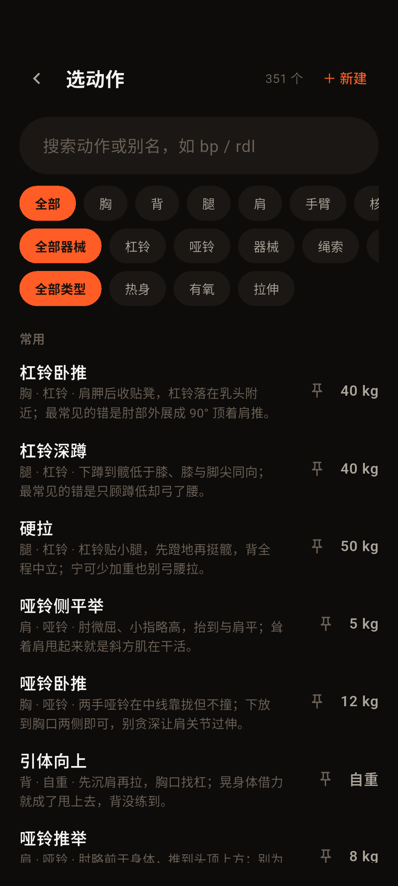
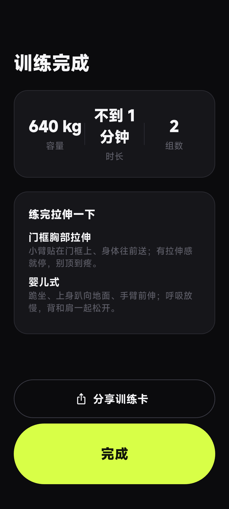
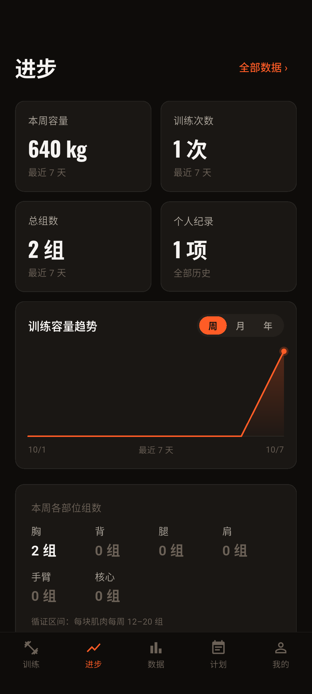
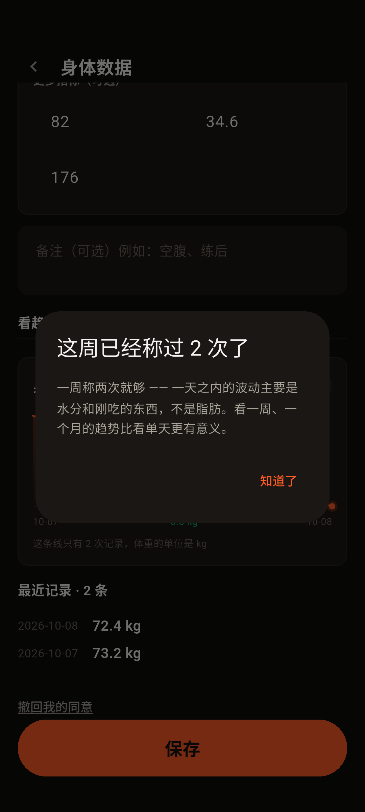

# 练了么 · 软件说明书（软著申报用）

> **状态**：2026-09-30 起草，用于「计算机软件著作权登记」提交。
> 事实全部取自仓库（每一条都能在代码里核到），不是套模板写的。
> 界面图见 `store-assets/screenshots/`（真实 App 生成，见 [`screenshots.md`](screenshots.md)）。
>
> **提交前需要你补的**：**只有实名信息**（见 [`copyright-application.md`](copyright-application.md)）。
> 界面图已就位：11 屏截图在 `store-assets/screenshots/`，本文第四节引用了其中 8 屏。
> 这批图是**当前版本**在 Android 模拟器（Pixel 6 / API 36，1080×2400）上跑
> `integration_test/screenshots_test.dart` 现出的 —— 见 [`screenshots.md`](screenshots.md)。

---

## 一、软件概述

**名称**：练了么（LianLeMe）
**版本**：V1.47.0
**类型**：移动应用软件（Android）
**运行环境**：Android 7.0（API 24）及以上；包名 `com.sdknwdtvpv.lianleme`

练了么是一款**离线优先的力量训练记录工具**。它要解决的问题很具体：
健身房里练到一半，还要在手机上翻动作、算重量、数次数、记组 —— 记录本身比训练还累，
于是多数人练完什么都没留下，下次去还是凭感觉。

产品的做法是把"记录一组"压到**一次点击**，并把"下一组该上多少"直接写在按钮上。
软件不要求注册、不索取手机号、不定位、不读通讯录；训练数据只存在手机本地。

## 二、开发与运行环境

| | |
|---|---|
| 开发语言 | Dart（应用与规则引擎）、JavaScript（规则引擎的参考实现与工具链）、Python（图标生成，一次性） |
| 开发框架 | Flutter 3.47.5（stable）/ Dart SDK ≥ 3.5.0 |
| 本地数据库 | SQLite（经 drift 管理），当前模式版本 **v19** |
| 开发环境 | macOS（Apple Silicon），Android SDK，Gradle |
| 运行环境 | Android 7.0（API 24）～ Android 16（API 36），arm64 / armeabi-v7a / x86_64 |
| 源程序量 | **221 个源文件 / 59,270 行**（截至 V1.47.0，仅统计自研源码：Dart / JS / Python；不含生成代码与第三方依赖） |

## 三、主要功能模块

### 3.1 一键记录（首页 → 训练屏）

首页只有一个主按钮「开始今天的训练」，点一下直达训练屏。
训练屏上是一个占满宽度的大按钮，**按钮上直接写着建议的重量与次数**，
点一次记一组。同一动作的第 2 组起，记录一组的操作次数是 **1 次**
（端到端口径由 `tool/analytics-report.mjs` 统计 `tap_count`，并有自动化门禁守着）。

长按大按钮打开步进弹层，可以改重量 / 次数 / 时长 / 距离。

### 3.2 渐进建议（核心算法）

每一组之前，软件根据**这个动作的历史**给出下一组的重量与次数，并**说明理由**。
判断顺序与文案都取自 `engine/progression.mjs`（下表逐条可核）：

| 情况 | 建议 | 理由文案（实际显示给用户的话） |
|---|---|---|
| 用户最近连续 ≥3 次手改过这个动作 | 沿用他自己设的值 | 「按你最近 3 次手动设置的重量」 |
| 第一次练这个动作 | 动作库的起始重量 / 先记录能做的次数 | 「第一次练这个动作，先从这个重量开始」 |
| 距上次练该动作 ≥ 21 天 | **保持上次重量**（回归保护，不降重） | 「已经有 N 天没练这个动作，先按上次重量找回感觉」 |
| 上次没做够组数 | 保持重量，先补组数 | 「上次只完成 1 组（计划 3 组），先把组数补满」 |
| 上次每组都到次数上限 | 加重一个步长 | 「上次 4 组全部达标，线性加重 +2kg」 |
| 上次有组掉下来 | 保持重量 | 「上次有组掉到 6 次，先保持重量」 |
| 差一点达标 | 保持重量，先把次数补齐 | 「上次差一点达标，先把每组次数补到 8」 |
| 自重动作做满上限 | 建议加负重 | 「自重已完成 17 次，建议加负重」 |
| 辅助动作（辅助引体/双杠）达标 | **减轻助力**（越练越强 = 助力越少） | 「上次 4 组全部达标，减轻助力 −5kg」 |
| 辅助减到 0 | 提示可以不用辅助 | 「助力已减到 0（上次 8 次达标），可以试试不用辅助了」 |
| 按时长的动作（平板支撑等）达标 | 加秒数，到上限后加重 | 「已能坚持 35 秒（上限 30 秒），加重 +5kg」 |

> 上表第一版是我**凭印象**写的（写成"平台期降 10%""14 天未练降到 90%"），
> 与引擎实际实现不符 —— 核对代码时发现并改正。说明书里的算法描述必须逐条对得上代码，
> 否则它比不写更糟。

规则引擎有**两套独立实现**（JavaScript 与 Dart），共用同一份
**45 条测试向量 / 60 项断言**，两边必须给出完全一致的结果。

### 3.3 今日推荐

首页中间是**「今天的安排」**：今天要练的动作 + 每个动作的建议重量与次数，
可以「换一批」。点这张卡进入建议卡页，那里能看**为什么给这个建议**、
「我自己选」或改用「我的计划」。不想自己安排的人**不需要先做计划** ——
点首页大按钮「开始今天的训练」直接用这份安排开练。

训练日按**上下肢分化**交替（上肢日：胸 3 + 背 2 + 肩 1；下肢日：腿 4 + 核心 2），
第一次使用默认给出 4 个动作 / 12 组。**热身、有氧、拉伸不会被排进力量推荐**
（按动作类别过滤），它们只在选择器与热身/拉伸区出现。

### 3.4 动作库（351 个动作）

内置 **351 个**动作（力量 318 / 热身 11 / 有氧 13 / 拉伸 9），支持：

- **按名称与别名检索**（输入 `bp` 能搜到「杠铃卧推」）
- **按部位 / 器械 / 类别三排筛选**（家里只有一对哑铃的人可以只看哑铃动作）
- **每个动作都有动作说明**（351/351 全覆盖，说明怎么写、常见错是什么）
- **动作详情页**：长按列表里的动作、或在训练屏点动作名旁的信息图标进入 ——
  显示"历史最好 / 总组数 / 最近几次"，加上做法与常见错误（练之前先看一眼，不用退出去查）
- 新建自定义动作

### 3.5 有氧与距离

跑步、跳绳、划船机、农夫行走这类动作走**距离 / 时长**记录，
训练屏上的按钮念的是「5.00 公里 · 30:00」，不是「自重 × 1800」。
首次练某个有氧动作时，默认距离来自动作库里的**处方**（而不是 0）。

### 3.6 身体数据

记录体重与备注（"空腹"、"练后"这类）。体重单位可在**千克 / 斤**之间实时切换
（换算比例为 1 千克 = 2 斤），
切换立即生效并写入本地库。
体重属于《个人信息保护法》定义的**敏感个人信息**，因此进入本模块前会**单独征求一次同意**
（首次启动那道政策总同意不能顶替它），页面底部另提供**「撤回我的同意」**入口：
撤回后立即停止收集、下次进入重新征求同意，而已记录的历史数据不会被自动删除。

### 3.7 进步

容量曲线、个人纪录（PR）墙、每周训练次数、逐动作的历史最好成绩。

### 3.8 训练总结

一次训练结束后给出容量 / 时长 / 组数三个数字，破了纪录会单独标出。
有氧的里程单独统计并算配速，**不混进力量容量**（两个量纲）。

### 3.9 数据安全与隐私

- **导出 CSV**、**导出 / 导入完整备份**（换手机不丢数据）
- **删除全部数据**（二次确认，一并清空身体数据与未上报的埋点事件）
- **「帮助改进产品」开关**（**默认关闭**、需用户主动开启、随时可关；关闭后除崩溃外零上报）
- 当前发布版本**不含任何上报地址**，训练数据不会离开设备（可由附录 B 的命令自行验证）
- **云备份**（v1.21.0 起）：训练记录可加密备份到服务器，恢复码是唯一钥匙。
  三点如实说明：① **默认关闭**；② 内容是**端到端加密**的，服务端只有密文，
  看不到动作名、重量、体重；③ **当前发布的包没有配服务器地址，界面上不会出现这个入口** ——
  也就是说，这个版本里的数据一条都不会上传
- **删除全部数据**：二次确认；若这台设备开过云备份，会多问一句是否**一并删除云端备份并注销**
  （默认一并删）。实现上先删云端、失败就整个中止，避免出现"本机删了、云端还留着"
  而恢复码已经没了的状态

## 四、操作说明（配图）

| 界面 | 操作说明 |
|---|---|
| 截图 | 说明 |
|---|---|
|  | **首页**：打开即看到「今天练什么」。不想做计划的人直接点「开始今天的训练」。 |
|  | **建议卡**：点首页「今天的安排」卡进入。每个动作右侧是建议重量与次数，下方一行是**为什么给这个建议**（例：「上次 4 组全部达标，线性加重 +2kg」）。 |
|  | **我的计划**：把常练的动作存成计划，下次直接按计划开始。 |
|  | **选动作**：351 个内置动作，三排筛选（部位 / 器械 / 类别）；每个动作下方是动作说明。 |
|  | **训练屏**：大按钮上直接写着建议的重量与次数，点一下记一组；长按打开步进弹层。 |
|  | **训练完成**：容量 / 时长 / 组数，破纪录单独标出，可分享训练卡。 |
|  | **进步**：本周容量、周训练次数、个人纪录墙、逐动作最好成绩。 |
|  | **身体数据**：记录体重与备注；体重单位可在千克 / 斤之间**实时切换**。 |

> 全部 11 屏（含训练屏、记完一组、全部数据、我页）见
> [`../store-assets/screenshots/`](../store-assets/screenshots/) 与 [`screenshots.md`](screenshots.md)。

## 五、技术特点

1. **双实现规则引擎 + 共享测试向量**：同一套渐进规则用 JavaScript 与 Dart 各写一遍，
   45 条向量两边都必须通过 —— 避免"测试证明了引擎是对的，而线上跑的是另一套"。
2. **变异测试**：把源码故意改坏（24 个变异体），看测试会不会红。
   当前 24 个全部被杀死、0 个存活、2 个语义等价（得分 100%）。
   —— 它回答的是"这些测试到底在守着行为，还是只在自我安慰"。
3. **端到端体验门禁**：记录一组的点击次数（`tap_count`）有自动化统计与发布闸门，
   中位数比上一版变差就不许发。
4. **数据库迁移有测试**：模式版本已从 v1 演进到 v19（19 次迁移）。测试按
   **v1 / v2 / v4 / v5 / v6 / v7 / v8 / v9 / v10 / v11 各挑一个代表版本**建出当时结构的库，
   再用当前代码打开，断言"不崩、新表可用、老数据一条没动"（共 9 条），
   另有一条专门守着夹具本身（老库里确实没有后来才加的那一列）。
   老版本用户升级不会丢数据，且这一点是**测出来的**，不是承诺。
5. **隐私可自证**：埋点字段、权限、政策正文三者由脚本逐条对账
   （`tool/privacy-audit.mjs`），代码发的每一条事件都必须在政策里写清楚。
6. **离线优先**：训练进行中不发任何网络请求；事件先落本地队列，择机批量上报。

## 六、自检与质量保证（可作为"软件质量"佐证）

| 层 | 内容 |
|---|---|
| 契约层 | 动作库种子构建、JS 引擎 45 条向量、8 个场景（152 步 / 12 条产品红线） |
| 领域层 | Dart 引擎 vs 同一份向量（60 项断言）、`tap_count` 边界 |
| 应用层 | Flutter widget 与界面测试（数量随版本变化，当前值见 `docs/release-checklist.md` 的"当前状态速览"） |
| 静态分析 | `dart analyze --fatal-infos` 零问题 |
| 变异测试 | 24 个变异体全部被杀死（0 存活） |
| 一致性 | 隐私政策对账、可用性测试口径自检、发行资源检查、隐私政策页面防漂移 |

一条命令跑完全部六层：`./verify.sh`。
